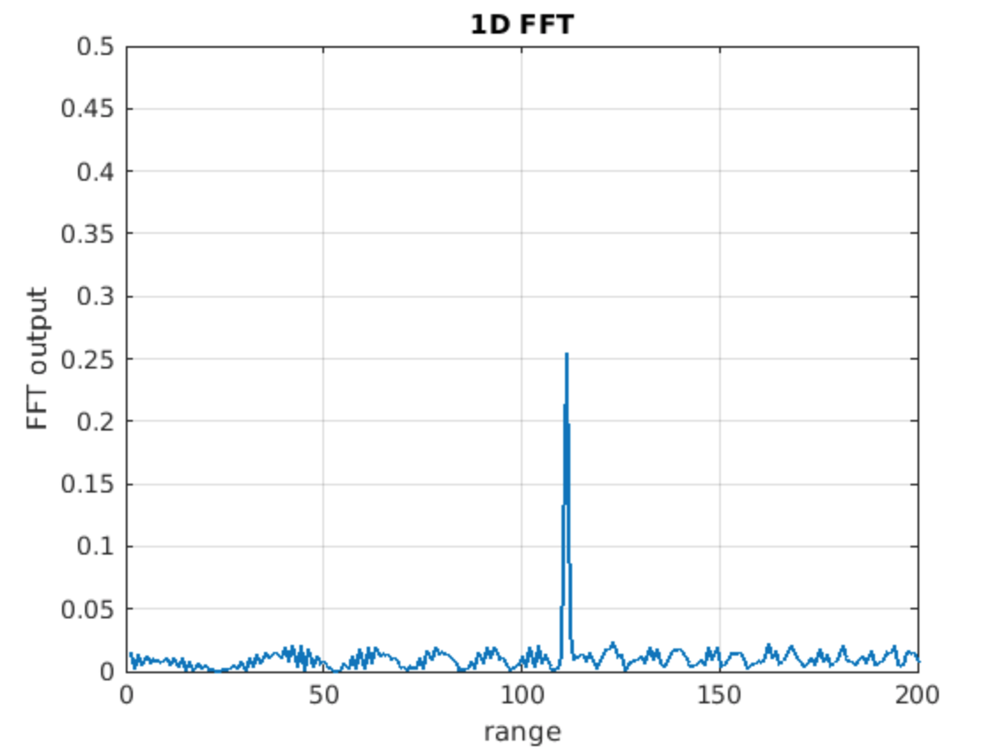
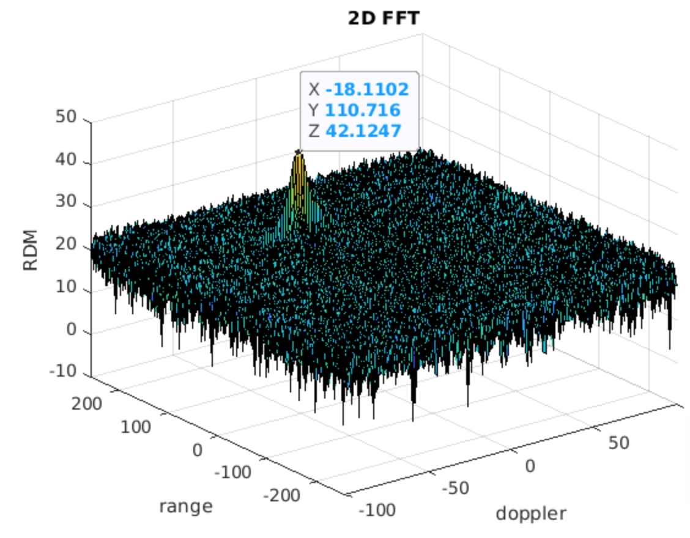

# 2D CFAR 
2D FFT, Doppler effect and CFAR implementation with matlab

## FMCW Waveform Design
### FMCW(Frequency-Modulated Continuous Wave)
FMCW radar (Frequency-Modulated Continuous Wave radar) is a special type of radar sensor which radiates continuous transmission power. FMCW radar’s ability to measure very small ranges to the target as well as its ability to measure simultaneously the target range and its relative velocity makes it the first choice type of radar for automotive applications. A Frequency Modulated Continous Wave (FMCW) is a signal in which the frequency increases/decreases with time. They are also referred to as upramps and downramps.

### Radar system Requriements
The sensor fusion design for different driving scenarios requires different system configurations from a Radar. 
|parameter|value|
|-----|----|
|Frequency_of_operation | 77GHz|
|Max_Range | 200m |
|Range_Resolution | 1 m |
|Max_Velocity |100 m/s |

### Target's initial position and velocity 
Velocity remains contant initial range:max value of 200m and velocity: [-70 to + 70 m/s]
* target_range = 110
* target_velocity = -20
* speed of light = 3.0e+8

Max Range and Range Resolution in the above are considered  for waveform design.
The sweep bandwidth is determined according to the Range Resolution and the sweep slope is calculated using both sweep bandwidth and sweep time.
> Bandwidth (B) = SpeedOfLight/(2∗Range_Resolution)

The sweep time can be computed based on the time needed for the signal to travel the unambiguous maximum range. In general, for an FMCW radar system, the sweep time should be at least 5 to 6 times the round trip time. In this projecgt, sweep time is 5.5.

### Chirp Time(Tchirp)
One chirp sequence or segment comprises of multiple chirps. Each chirp is sampled multiple times to give multiple range measurements and radar transmits in order to measure doppler velocity accurately.
In the project sampling each chirp is 1024 times and 128 of these chirps are sent to estimate the range and doppler velocity; i.e. the segment is 128 chirps.
* The number of samples on each chirp: Nr=1024
* The number of chirps in one sequence: Nd=128
> chirp time (Tchirp) =5.5⋅2⋅(Max_Range)/SpeedOfLight

Giving the slope of the chirp signal
> slope of the chirp  = Bandwidth(B)/T_chirp
> slope = 2.0455e+13 % result

## 1D FFT (1st order FFT)
Implement the Range FFT on the Beat or **Mixed Signal** and plot the result.
generate a peak at the correct range, i.e the initial position of target assigned with an error margin of +/- 10 meters.
**Mixed Signal**: The beat signal can be calculated by multiplying the Transmit signal with Receive signal. This process in turn works as frequency subtraction. It is implemented by element by element multiplication of transmit and receive signal matrices.

## 2D FFT (2nd order FFT)

## Simulation Loop 
Simulate Target movement and calculate the beat or mixed signal for every timestamp
A beat signal should be generated such that once range FFT implemented, it gives the correct range i.e the initial position of target assigned with an error margin of +/- 10 meters.

## Implementation steps for the 2D CFAR process
### What is CFAR? 
Technically, Cell Averaging CFAR (CA-CFAR)method; CA-CFAR is the most commonly used CFAR detection technique. CFAR varies the detection threshold based on the vehicle surroundings. The CFAR technique estimates the level of interference in radar range and doppler cells “Training Cells” on either or both the side of the “Cell Under Test”. The estimate is then used to decide if the target is in the Cell Under Test (CUT).
The process loops across all the range cells and decides the presence of target based on the noise estimate.The basis of the process is that when noise is present, the cells around the cell of interest will contain a good estimate of the noise, i.e. it assumes that the noise or interference is spatially or temporarily homogeneous. Theoretically it will produce a constant false alarm rate, which is independent of the noise or clutter level.
### Implementation Steps 
Implement the 2D CFAR process on the output of 2D FFT operation, i.e the Range Doppler Map.
The 2D CFAR processing should be able to suppress the noise and separate the target signal
The 2D CA-CFAR implementation involves the training cells occupying the cells surrounding the cell under test with a guard grid in between to prevent the impact of a target signal on the noise estimate.

1. Determine the number of Training cells for each dimension Tr and Td. Similarly, pick the number of guard cells Gr and Gd.
    * Tr : Number of Training Cells = 8 
    * Td: Number of doppler cells = 4 
    * Gr : Number of Guard Cells = 4 
    * Gd: Number of Gaurd doppler cells = 2 
2. Slide the Cell Under Test (CUT) across the complete cell matrix
3. Select the grid that includes the training, guard and test cells. Grid Size = (2Tr+2Gr+1)(2Td+2Gd+1).
4. The total number of cells in the guard region and cell under test. (2Gr+1)(2Gd+1).
5. This gives the Training Cells : (2Tr+2Gr+1)(2Td+2Gd+1) - (2Gr+1)(2Gd+1)
6. Measure and average the noise across all the training cells. This gives the threshold
7. Add the offset (if in signal strength in dB) to the threshold to keep the false alarm to the minimum.
    * offset: Adding room above noise threshold for desired SNR 
8. Determine the signal level at the Cell Under Test.
9. If the CUT signal level is greater than the Threshold, assign a value of 1, else equate it to zero.
10. Since the cell under test are not located at the edges, due to the training cells occupying the edges, we suppress the edges to zero. Any cell value that is neither 1 nor a 0, assign it a zero.

## Selection of Training, Guard cells and offset.

## suppress the non-thresholded cells at the edges.
2D CFAR suppress the noise and separate the target signal
